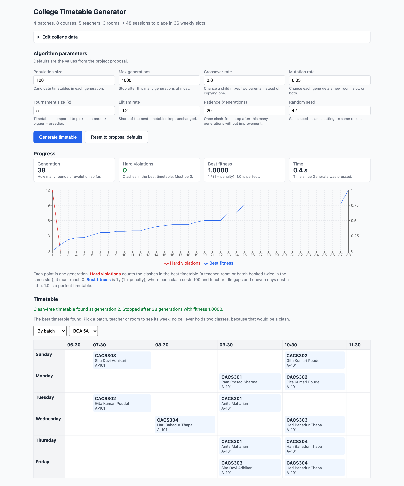
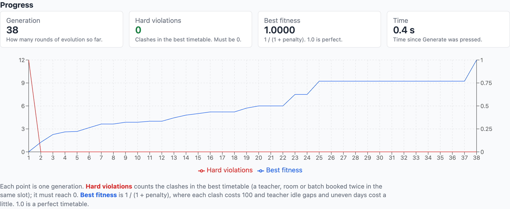

<!--
  Print/Word layout notes for whoever converts this to the college template:
    * Every "---" is a page break in the printed report.
    * Front matter (cover page to List of Abbreviations) is numbered i, ii, iii …
      Chapter 1 restarts at Arabic 1.
    * Headings map to Word styles: "# " -> Title, "## " -> Heading 1,
      "### " -> Heading 2, "#### " -> Heading 3.
    * Items in «guillemets» must be filled in by hand before printing.
-->

<div align="center">

«College logo»

# Tribhuvan University
## Faculty of Humanities and Social Sciences

### Final Project Report
#### On
# Automated College Timetable Generator
#### Using a Genetic Algorithm

**Submitted to**
Department of Computer Application
Academia International College
Gwarko, Lalitpur

*In partial fulfilment of the requirements for the*
*Bachelor in Computer Application*
*(CACS452 — Project III, Eighth Semester)*

**Submitted by**
Prajwal Basnet (6-2-346-22-2021)
Shekhar Paudel (6-2-346-30-2021)

«Month, Year»

**Under the Supervision of**
Mausam Pokhrel

</div>

---

<div align="center">

«College logo»

# Tribhuvan University
## Faculty of Humanities and Social Sciences
## Academia International College

# SUPERVISOR'S RECOMMENDATION

</div>

I hereby recommend that this project prepared under my supervision by **Prajwal Basnet** and
**Shekhar Paudel** entitled **"Automated College Timetable Generator"** in partial fulfilment
of the requirements for the degree of Bachelor in Computer Application be processed for evaluation.

<br><br>

…………………………………

**SIGNATURE**

Mausam Pokhrel
Supervisor
Department of Computer Application
Academia International College, Gwarko, Lalitpur

---

<div align="center">

«College logo»

# Tribhuvan University
## Faculty of Humanities and Social Sciences
## Academia International College

# LETTER OF APPROVAL

</div>

This is to certify that this project prepared by **Prajwal Basnet** and **Shekhar Paudel**
entitled **"Automated College Timetable Generator"** in partial fulfilment of the
requirements for the degree of Bachelor in Computer Application has been evaluated. In our opinion it is satisfactory in scope and quality as a
project for the required degree.

<br>

| | |
|---|---|
| SIGNATURE of Supervisor<br>…………………………<br>Mausam Pokhrel<br>Academia International College<br>Gwarko, Lalitpur | SIGNATURE of Coordinator<br>…………………………<br>«Coordinator Name»<br>Co-ordinator<br>Academia International College<br>Gwarko, Lalitpur |
| SIGNATURE of Internal Examiner<br>…………………………<br>Internal Examiner | SIGNATURE of External Examiner<br>…………………………<br>External Examiner |

---

# ACKNOWLEDGEMENT

We extend our heartfelt gratitude to Mausam Pokhrel, our supervisor at Academia
International College, for the guidance, patience and technical scrutiny that shaped this
project. The insistence that every performance claim be measured rather than asserted is the
reason Chapter 5 reports seeded, reproducible measurements instead of an estimate.

We are grateful to the Department of Computer Application and to the college management for
the resources and platform to carry out this project, and to the faculty for the coursework in
Design and Analysis of Algorithms and Web Technologies on which it builds. We also thank the
administrative staff who described the existing manual timetabling process to us; the five
shortcomings in Section 1.2 are their account of the problem. Finally, we thank our classmates
for their feedback during the increment reviews.

<br>

Yours sincerely,

**Prajwal Basnet** (6-2-346-22-2021)
**Shekhar Paudel** (6-2-346-30-2021)

---

# ABSTRACT

This project presents an **Automated College Timetable Generator** that constructs
conflict-free weekly class schedules using a **Genetic Algorithm implemented from scratch**,
with no optimisation or solver library. Timetabling is an NP-hard constraint satisfaction
problem, and colleges affiliated with Tribhuvan University typically build the schedule by hand
over two to three weeks, often with double-bookings that surface only after the semester begins.

The system schedules a small sample dataset — two programmes with two sections each, eight
courses, five teachers, three rooms and four batches, giving 48 weekly sessions in 36 time
slots. Each candidate timetable is a chromosome with one gene per session, scored by
*f = 1 / (1 + total penalty)*. Teacher, room and batch clashes cost 100 each; qualification and
room capacity are guaranteed by construction; two small soft penalties discourage idle gaps and
uneven daily loads. Tournament selection, single-point crossover, per-gene mutation and elitism
drive the search, followed by a small targeted repair step. The system is a browser-only React
and TypeScript application that draws the convergence live and shows the result by batch,
teacher or room. The database, login and export of the proposal were left out.

Over ten seeded runs the system finds a clash-free timetable in a mean of **2.2 generations
and 26 milliseconds**, and every run reaches **fitness 1.0**, against a requirement of 500
generations and 120 seconds. Without repair the plain algorithm needs 16.2 generations and only
two of ten runs reach fitness 1.0. On an earlier 180-session dataset of the proposal's NFR1 size,
the system was clash-free in 384 ms mean.

**Keywords:** Genetic Algorithm, Timetable Scheduling, NP-hard, Constraint Satisfaction,
Memetic Algorithm, TypeScript.

---

# LIST OF FIGURES

| Figure | Title | Page |
|---|---|---|
| Figure 1.1 | Incremental Model of Development | «p» |
| Figure 3.1 | Use Case Diagram of the User | «p» |
| Figure 3.2 | Gantt Chart of the Project Schedule | «p» |
| Figure 3.3 | Class Diagram of the Algorithm | «p» |
| Figure 3.4 | Sequence Diagram of Timetable Generation | «p» |
| Figure 3.5 | Activity Diagram of the Genetic Algorithm | «p» |
| Figure 4.1 | System Architecture and Components | «p» |
| Figure 4.2 | Chromosome Encoding of a Candidate Timetable | «p» |
| Figure 5.1 | The Application After a Run | «p» |
| Figure 5.2 | Convergence of Hard Violations and Best Fitness | «p» |

> UML figures are drawn from the Mermaid source in [`UML.md`](UML.md) and exported to PNG for
> the printed report. Figures 5.1 and 5.2 are screenshots of the running application.

---

# LIST OF TABLES

| Table | Title | Page |
|---|---|---|
| Table 1.1 | Deviations from the Proposal | «p» |
| Table 3.1 | Functional Requirements | «p» |
| Table 3.2 | Non-Functional Requirements | «p» |
| Table 3.3 | Hard Constraints and Penalty Weights | «p» |
| Table 3.4 | Soft Constraints and Penalty Weights | «p» |
| Table 3.5 | Technology Package Table | «p» |
| Table 3.6 | Economic Feasibility Table | «p» |
| Table 4.1 | Sample Dataset | «p» |
| Table 4.2 | Modules of the Genetic Algorithm Engine | «p» |
| Table 4.3 | Genetic Algorithm Parameters | «p» |
| Table 5.1 | Test Environment Table | «p» |
| Table 5.2 | Test Cases | «p» |
| Table 5.3 | Ten Seeded Runs With and Without Repair | «p» |
| Table 5.4 | Summary: Effect of the Repair Step | «p» |

---

# LIST OF ABBREVIATIONS

| | |
|---|---|
| **BCA** | Bachelor in Computer Application |
| **CSIT** | Computer Science and Information Technology |
| **FR** | Functional Requirement |
| **GA** | Genetic Algorithm |
| **NFR** | Non-Functional Requirement |
| **NP** | Nondeterministic Polynomial time |
| **PDF** | Portable Document Format |
| **UML** | Unified Modeling Language |

---

# Chapter 1: Introduction

## 1.1 Introduction

The **Automated College Timetable Generator** constructs a conflict-free weekly class schedule
for a college. Constraints on teachers, batches, rooms and time slots interact, so fixing one
clash often creates another. Timetabling is **NP-hard** [1], and even the small sample dataset
here admits on the order of 10^95 candidate timetables, so exhaustive search is impossible.

This project applies a **Genetic Algorithm** [2]–[4], written from scratch in TypeScript, in a
browser page where the user presses **Generate timetable** and watches the search live.

## 1.2 Problem Statement

Colleges affiliated with Tribhuvan University often spend two to three weeks building
timetables by hand, with five shortcomings:

| Shortcoming | Consequence |
|---|---|
| **Resource conflicts** | Double-booked teachers or rooms are hard to spot by eye. |
| **Time inefficiency** | Weeks each semester; any change forces near-complete rework. |
| **Suboptimal utilisation** | Large rooms for small classes; long teacher idle gaps. |
| **Lack of scalability** | Each new batch interacts with every existing one. |
| **No standardised validation** | Errors surface only after the semester has begun. |

The problem is to build a conflict-free timetable automatically, in seconds rather than weeks.

## 1.3 Objectives

1. To design and implement a custom Genetic Algorithm from scratch that produces a weekly
   timetable satisfying all hard constraints.
2. To incorporate soft-constraint optimisation in the fitness function, reducing instructor
   idle gaps and evening out each batch's daily load.
3. To display the timetable, and the algorithm's progress while it runs, from the batch,
   instructor and room perspectives.
4. To evaluate convergence and the effect of the repair step over seeded runs.

## 1.4 Scope and Limitation

### 1.4.1 Scope

The scope is a from-scratch GA (seven steps plus repair), a small editable dataset (Table 4.1)
with data checks, a live chart, a timetable grid and ten tests.

### 1.4.2 Limitation

No data is saved, there is no login or export, and the model is simplified (Section 6.2).

### 1.4.3 Deviations from the Proposal

An earlier full-stack build was removed to show only the algorithm (Table 1.1).

**Table 1.1: Deviations from the Proposal**

| Proposal item | Status in the delivered system |
|---|---|
| FR1 data management; FR3 grid filters | Partial: unsaved in-browser editing; grid by batch, teacher or room |
| FR5 export; FR6 login; NFR3 database | Not implemented |
| NFR4 — errors for impossible data | Partial: four checks (§5.1.2) |
| Step 3 — capacity as a penalty | Changed: guaranteed by construction, as is qualification |
| Constraints; Steps 1–7 | Extended: batch clash (§4.3.3); repair (§4.3.6) |

## 1.5 Development Methodology

### 1.5.1 Incremental Model

The **Incremental Model** was followed, each increment ending in testing and review: (1) data
and encoding; (2) Steps 2–7 as specified, which converged slowly; (3) repair and soft weights
below one clash; (4) interface, tests and measurements, removing the server, database and login.

<div align="center">

«Figure 1.1 — Incremental Model of Development»

**Figure 1.1: Incremental Model**

</div>

## 1.6 Report Organization

Chapters 2–6 cover literature, analysis, design, implementation and testing, and conclusion.

---

# Chapter 2: Background Study and Literature Review

## 2.1 Background Study

Candidate schedules grow exponentially with the sessions, and Even and Itai proved timetabling
NP-hard [1].

**Terminologies related to this project:**

- **Session:** one weekly lecture of a course for one batch. **Time slot:** one (day, period)
  pair; six days × six periods give 36. **Batch:** a cohort of one programme and section.
- **Hard / soft constraint:** a condition a usable timetable must meet / a property that only
  improves quality.
- **Chromosome / gene:** one candidate timetable / the teacher, room and slot of one session.
  **Fitness:** its score, 1.0 when flawless. **Generation:** one cycle of evaluation, selection,
  crossover and mutation. **Elitism:** carrying the best forward unchanged.

**The Genetic Algorithm** scores a population of candidates, selects fitter ones as parents,
and recombines and mutates them into the next generation [2]. It needs no gradients, so it
suits a discrete, constrained problem such as timetabling [3].

## 2.2 Literature Review

**Academic literature.** Colorni, Dorigo and Maniezzo found genetic algorithms effective on
highly constrained school timetabling, especially with local search [4], as Section 5.3.3
confirms. Abramson used simulated annealing, showing metaheuristics viable where exact methods
are not, but sensitive to parameters [5].

**Existing systems.** *FET* is an open-source desktop scheduler with a dense interface;
*aSc TimeTables* is commercial, costly and school-oriented; *UniTime* is an open-source
university system whose deployment presumes a much larger institution.

**The gap addressed.** These tools are heavy or costly and hide the algorithm; this project
writes a small engine from scratch, shows its convergence live, and measures it.

---

# Chapter 3: System Analysis

## 3.1 System Analysis

### 3.1.1 Requirement Analysis

#### 3.1.1.1 Functional Requirements

Table 3.1 gives each requirement's status; Figure 3.1 shows the User's five use cases: *Edit
college data*, *Set GA parameters*, *Generate timetable*, *Watch progress*, *View timetable*.

**Table 3.1: Functional Requirements**

| ID | Requirement | Status |
|---|---|---|
| FR1 | CRUD on all college data, including departments and time slots | **Partial** — four entities, unsaved |
| FR2 | GA engine: no teacher or room double-booking, no capacity violation | **Implemented** — plus batch clash |
| FR3 | Grid by teacher, batch, room, department; lab colouring | **Partial** — batch, teacher, room |
| FR4 | Real-time generation number and fitness | **Implemented** — tiles and live chart |
| FR5 | Export to PDF and Excel | **Not implemented** |
| FR6 | Authentication with role-based access control | **Not implemented** |

<div align="center">

«Figure 3.1 — Use Case Diagram of the User»

**Figure 3.1: Use Case Diagram of the User**

</div>

#### 3.1.1.2 Non-Functional Requirements
**Table 3.2: Non-Functional Requirements**

| ID | Requirement | Status |
|---|---|---|
| NFR1 | Clash-free for 6 programmes, 30 courses, 20 teachers, 15 rooms in 120 s | **Met** on the earlier 180-session data |
| NFR2 | Responsive interface from 768 px to desktop | **Met** — fluid layout |
| NFR3 | Persistence in a relational database | **Not implemented** |
| NFR4 | Meaningful errors for impossible data | **Partial** — four checks (§5.1.2) |

#### 3.1.1.3 Constraint Specification

**Table 3.3: Hard Constraints and Penalty Weights**

| Constraint | How it is enforced |
|---|---|
| Teacher assigned to two sessions in one slot | Penalty 100 each |
| Room assigned to two sessions in one slot | Penalty 100 each |
| Batch assigned to two sessions in one slot | Penalty 100 each |
| Room smaller than the batch | By construction (only large rooms offered) |
| Teacher not qualified for the course | By construction (only qualified teachers) |

**Table 3.4: Soft Constraints and Penalty Weights**

| Constraint | Penalty weight |
|---|---|
| Teacher idle gap between taught periods on one day | 0.3 each |
| Uneven spread of a batch's classes across the week | 0.2 × deviation from daily mean |

### 3.1.2 Feasibility Analysis

#### 3.1.2.1 Technical Feasibility

No server, database or solver library is needed, so nothing is opaque (Table 3.5).

**Table 3.5: Technology Package Table**

| Package | Version | Compatibility | Purpose |
|---|---|---|---|
| React | 18.3 | ES2020 browsers | User interface |
| TypeScript | 5.7 | — | Language |
| Vite | 6.0 | Node.js ≥ 20 | Dev server and build |
| Recharts | 2.15 | React ≥ 17 | Live chart (FR4) |
| Vitest | 2.1 | Node.js ≥ 20 | Automated tests |
| **GA engine** | — | — | **From scratch; no dependencies** |

#### 3.1.2.2 Operational Feasibility

The system runs in any modern browser with no installation. All tools are open source (Table 3.6).

#### 3.1.2.3 Economic Feasibility

**Table 3.6: Economic Feasibility Table**

| Cost category | Item | Cost |
|---|---|---|
| Development | Own hardware; open-source software; no solver licence | Nil |
| Deployment and operation | Static hosting or local run; maintenance | Nil; minimal |

#### 3.1.2.4 Schedule Feasibility

The four increments of Section 1.5.1 each ended in a review.
<div align="center">

«Figure 3.2 — Gantt Chart»

**Figure 3.2: Gantt Chart of the Project Schedule**

</div>

### 3.1.3 Analysis

#### 3.1.3.1 Class Diagram

Figure 3.3 shows the data types and the algorithm types (Problem, Session, Gene, Chromosome, …).

<div align="center">

«Figure 3.3 — Class Diagram of the Algorithm»

**Figure 3.3: Class Diagram of the Algorithm**

</div>

#### 3.1.3.2 Sequence Diagram

The App calls `buildProblem` and `runGA`; each generation's Progress redraws the chart, and
the Result goes to the Timetable component (Figure 3.4).

<div align="center">

«Figure 3.4 — Sequence Diagram of Timetable Generation»

**Figure 3.4: Sequence Diagram of Timetable Generation**

</div>

#### 3.1.3.3 Activity Diagram

Figure 3.5 shows the seven steps of the algorithm, with repair marked as an addition.

<div align="center">

«Figure 3.5 — Activity Diagram of the Genetic Algorithm»

**Figure 3.5: Activity Diagram of the Genetic Algorithm**

</div>

---

# Chapter 4: System Design

## 4.1 Architectural Design

The system runs entirely in the browser and has three parts: the **data** (`src/data.ts`), the **algorithm** (`src/ga/`, one file per step,
pure TypeScript with no dependency on React, so the tests run the same code) and the
**interface** (`src/App.tsx`, `src/DataEditor.tsx`, `src/Timetable.tsx`). Nothing in `src/ga/`
depends on the interface. The algorithm yields after each generation so the chart can redraw.

<div align="center">

«Figure 4.1 — System Architecture and Components»

**Figure 4.1: System Architecture and Components**

</div>

## 4.2 Data Design

**Table 4.1: Sample Dataset**

| Item | Count | Notes |
|---|---:|---|
| Programmes | 2 | BCA, B.Sc. CSIT |
| Courses | 8 | Four per programme, each 3 lectures a week |
| Teachers | 5 | Each qualified for two or three courses; qualifications overlap |
| Rooms | 3 | A-101 (50), A-102 (45), B-101 (40) |
| Batches | 4 | BCA 5A (48), BCA 5B (44), CSIT 5A (40), CSIT 5B (38) |
| Sessions | 48 | 4 batches × 4 courses × 3 lectures |
| Time slots | 36 | Sunday–Friday × six periods, 06:30–12:30 |

NFR1 was measured on an earlier version of this file (6 programmes, 30 courses, 20 teachers,
15 rooms, 12 batches, 180 sessions), kept in git history at commit `4a72724`.

## 4.3 Algorithm Details

### 4.3.1 Chromosome Encoding (Step 1)

A timetable is an array with one gene per session; the session list is fixed, so gene *i*
stores only the **teacher, room and time slot** of session *i*. Each session also holds the lists of qualified teachers and of
rooms large enough for its batch, and every operator draws only from these lists, so the
algorithm only has to remove clashes.

<div align="center">

«Figure 4.2 — Chromosome Encoding»

**Figure 4.2: Chromosome Encoding of a Candidate Timetable**

</div>

### 4.3.2 The Genetic Algorithm

**Table 4.2: Modules of the Genetic Algorithm Engine**

| Module | Responsibility |
|---|---|
| `problem.ts` | Step 1 — encoding: sessions, genes, chromosomes |
| `population.ts` | Step 2 — random population initialisation |
| `fitness.ts` | Step 3 — fitness evaluation |
| `selection.ts` | Step 4 — tournament selection |
| `crossover.ts` | Step 5 — single-point crossover |
| `mutation.ts` | Step 6 — mutation |
| `engine.ts` | Step 7 — the evolutionary loop and termination |
| `repair.ts` | Targeted repair (our addition) |
| `rng.ts` | Seeded random number generator (mulberry32), so every run is reproducible |

```
 1  sessions ← BUILD-PROBLEM(data); population ← 100 random chromosomes   // Steps 1, 2
 2  for generation ← 1 to 1000
 3      evaluate fitness of every individual                            // Step 3
 4      if a stopping rule of Section 4.3.5 holds: return best          // Step 7
 5      next ← top 20% of population                                    // elitism
 6      while |next| < 100
 7          c ← rand < 0.8 ? CROSSOVER(TOURNAMENT(5), TOURNAMENT(5))    // Steps 4, 5
 8                         : COPY(TOURNAMENT(5))
 9          MUTATE(c, 0.05); REPAIR(c); add c to next                   // Step 6 + repair
10      population ← next
```

**Fitness** is *f = 1 / (1 + total penalty)*: 100 per clash plus the soft penalties of Table
3.4, so a flawless timetable scores 1.0. In one pass, each (teacher, slot), (room, slot) and
(batch, slot) cell remembers the first gene to take it; a later gene there is a clash, and both
genes are recorded for repair. **Selection** is a tournament of k = 5, which uses only the
ordering of fitness; this matters because one clash scores about 0.0099 and two about 0.0050,
too narrow a band for roulette-wheel selection. **Crossover** is single-point at rate 0.8;
because gene *i* always describes session *i*, the child is always complete. **Mutation**
(rate 0.05 per gene) gives a gene a new room, a new slot, or both, from the session's lists.

**Table 4.3: Genetic Algorithm Parameters**

| Parameter | Value | Source |
|---|---|---|
| Population size | 100 | Proposal |
| Maximum generations | 1000 | Proposal |
| Crossover rate | 0.8 | Proposal |
| Mutation rate (per gene) | 0.05 | Proposal |
| Tournament size (k) | 5 | Proposal |
| Elitism | Top 20% | Proposal |
| Hard constraint weight | 100 | Proposal |
| Patience (generations without improvement, once clash-free) | 20 | Our addition (§4.3.5) |
| Random seed | 42 | Our addition, for reproducibility |

**Time complexity.** A fitness evaluation is O(G) for G genes and a generation O(N · G), with at
most 96 repair evaluations per child; at N = 100, G = 48 it takes around ten milliseconds.

### 4.3.3 Constraint Addition — Batch Clash

Without it, one batch could sit in two rooms at once while meeting every constraint the
proposal names, so the batch clash is a third hard constraint with penalty 100.

### 4.3.4 Soft Weights Below One Clash

All soft penalty together stays below one clash, so removing a clash is always worth more than
any soft improvement: clashes are fixed first, and the timetable is polished afterwards.

### 4.3.5 Termination (Step 7)

The loop stops when (1) best fitness equals 1.0, the proposal's condition; (2) the best is
clash-free and has not improved for 20 generations, a fallback for data where some soft penalty
cannot be removed; or (3) 1000 generations have run.

### 4.3.6 Targeted Repair — Our Addition

Random mutation rarely hits the few genes that actually clash. After mutation, repair takes up
to 12 clashing genes and tries 8 random placements for each, keeping a change only if the total
penalty falls, so it never makes a timetable worse. A genetic algorithm combined with such local
search is a **memetic algorithm**.

---

# Chapter 5: Implementation and Testing

## 5.1 Implementation

### 5.1.1 Tools Used

The tools are those of Table 3.5: **React**, **TypeScript**, **Vite**, **Recharts** and **Vitest**. The genetic algorithm itself uses none of them. The system is started with `npm install` and
`npm run dev`; `npm test` runs the ten tests.

### 5.1.2 Implementation of Modules

**Data (`src/data.ts`)** holds the sample data; qualifications overlap so most courses have
two or three qualified teachers. **Encoding (`src/ga/problem.ts`):** `buildProblem` expands
batches into sessions and reports a plain error, disabling Generate, for a duplicate course
code, a teacher or batch listing an unknown course, a course with no qualified teacher, or a
batch that fits no room. **Algorithm (`src/ga/`):** one file per step (Table 4.2); `runGA`
returns the best chromosome, its fitness, the generation it became clash-free and the time.
**Data editor (`src/DataEditor.tsx`):** four editable tabs; renaming a course code updates every
list that uses it. **Interface (`src/App.tsx`, `src/Timetable.tsx`):** GA parameter fields
pre-filled with the proposal's values, the *Generate timetable* button, four stat tiles, the
live chart, and a six-day by six-period grid. Every field and tile, and each file in `src/ga/`,
carries a one-line explanation.

<div align="center">



**Figure 5.1: The Application After a Run**

</div>

## 5.2 Testing

Ten tests in `src/ga/ga.test.ts` use the college data and a hand-built two-session problem.

**Table 5.1: Test Environment Table**

| | |
|---|---|
| Operating System | macOS (darwin arm64) |
| Runtime | Node.js 20 |
| Browser | Google Chrome, Brave, Firefox |
| Test Runner | Vitest 2 |

### 5.2.1 Test Cases for Unit Testing

Tests 1–9 (Table 5.2) check the encoding (FR2, NFR4), fitness function and operators (FR2).

### 5.2.2 Test Cases for System Testing

Test 10 runs the full algorithm (FR2, the 500-generation target). The interface was tested by hand:
the chart and tiles update live and the drop-downs show the matching timetable.

**Table 5.2: Test Cases**

| # | Area | Action | Expected Result | Result |
|---|---|---|---|---|
| 1 | Encoding | Build from the college dataset | 48 sessions | Pass |
| 2 | Encoding | Inspect teacher and room lists | All qualified; all rooms fit | Pass |
| 3 | Encoding | Use an unknown course code | Error naming it | Pass |
| 4 | Encoding | Give two courses one code | Error naming it | Pass |
| 5 | Fitness | Two sessions, no shared resource | 0 violations; f = 1/(1 + penalty) | Pass |
| 6 | Fitness | Two sessions, same teacher and slot | 1 violation; both genes flagged | Pass |
| 7 | Fitness | Two sessions, same room and slot | 1 violation | Pass |
| 8 | Operators | Cross two chromosomes | Each gene from a parent | Pass |
| 9 | Operators | Mutate at rate 1.0 | Rooms from list; slots in 0–35 | Pass |
| 10 | System | Full run, default seed | Clash-free within 500 gens, 120 s | Pass |

## 5.3 Result Analysis

All results use the parameters of Table 4.3 and seeds 1–10 (and 42, the demo default) on the
environment of Table 5.1, so they are reproducible.

### 5.3.1 Performance and NFR1 Compliance

**Table 5.3: Ten Seeded Runs With and Without Repair**

| Seed | Clashes, gen. 1 | Repair: clash-free at | Repair: total gens | No repair: clash-free at | No repair: total gens | No repair: fitness |
|---:|---:|---:|---:|---:|---:|---:|
| 1 | 10 | 2 | 27 | 13 | 84 | 1.0000 |
| 2 | 12 | 2 | 23 | 13 | 113 | 0.7692 |
| 3 | 13 | 2 | 47 | 17 | 105 | 0.5000 |
| 4 | 12 | 2 | 32 | 19 | 103 | 0.4348 |
| 5 | 14 | 3 | 25 | 18 | 103 | 0.4348 |
| 6 | 12 | 2 | 22 | 22 | 85 | 0.5882 |
| 7 | 13 | 2 | 41 | 17 | 120 | 1.0000 |
| 8 | 14 | 2 | 30 | 13 | 133 | 0.7143 |
| 9 | 14 | 3 | 18 | 19 | 107 | 0.7692 |
| 10 | 10 | 2 | 42 | 11 | 84 | 0.4167 |

With repair every run reached fitness 1.0000 (zero soft penalty) after 18–47 generations
(138–327 ms); the patience rule never fired.

**Table 5.4: Summary: Effect of the Repair Step**

| Metric | With repair | Without repair | Budget |
|---|---:|---:|---:|
| Runs reaching a clash-free timetable | 10 / 10 | 10 / 10 | — |
| Generations to clash-free (mean / worst) | 2.2 / 3 | 16.2 / 22 | 500 |
| Time to clash-free (mean / worst) | 26 ms / 38 ms | — | 120,000 ms |
| Runs reaching fitness 1.0 | 10 | 2 | — |
| Final fitness when 1.0 not reached | — | 0.42 – 0.77 | — |
| Final soft penalty | 0 | 0 – 1.4 | — |

**NFR1.** On the earlier 180-session dataset (Section 4.2) and the same seeds, the system was
clash-free in **384 ms mean and 442 ms worst** against 120 seconds, so NFR1 is met there.

### 5.3.2 Convergence Behaviour

With seed 42, generation 1's best has 12 hard violations; the first clash-free timetable
appears at **generation 2 (about 28 ms)**, and best fitness then climbs to **1.0000 at
generation 38** (about 0.3–0.4 s). Fitness jumps when the last clash goes (Figure 5.2).

<div align="center">



**Figure 5.2: Convergence of Hard Violations and Best Fitness**

</div>

### 5.3.3 Effect of the Repair Step

Without repair (the proposal's Steps 1–7 exactly) every run is still clash-free, but needs about
seven times as many generations, and eight of ten stall short of 1.0: blind mutation changes two
or three of the 48 genes per child, while repair changes only clashing genes.

---

# Chapter 6: Conclusion and Future Recommendation

## 6.1 Conclusion

This project delivers a genetic algorithm, written from scratch in TypeScript, that builds a
clash-free weekly timetable in well under a second: 2.2 generations and 26 ms mean on the sample
data, with fitness 1.0 in every seeded run, and 384 ms mean on the earlier NFR1-sized dataset,
against targets of 500 generations and 120 seconds. It follows the proposal's seven steps; its
departures and the narrowed scope are listed in Section 1.4.3.

The main finding is that the textbook genetic algorithm, implemented faithfully, does solve the
problem, but slowly, and it usually stalls short of fitness 1.0. A small repair step that moves
only the clashing genes makes it about seven times faster and lets every run reach 1.0.

## 6.2 Limitations

1. **Unsaved data.** Edits are lost on reload; departments, programmes and time slots can only
   be changed in `src/data.ts`.
2. **No persistence, login or export.** The timetable disappears when the tab is closed.
3. **Simplified model.** No laboratories, room types, departments or teacher availability.
4. **No completeness guarantee.** The algorithm cannot prove that no timetable exists.
5. **Hand-tuned soft weights,** chosen empirically rather than derived.
6. **Main-thread execution.** A much larger dataset would make the page feel slower.

## 6.3 Future Recommendations

- **Saved data and export:** a database for edited data, editing of departments and time slots,
  and PDF/Excel export (FR1, FR5).
- **Richer constraints:** laboratories, room types, teacher availability.
- **Minimal-perturbation rescheduling:** when a teacher becomes unavailable, penalise distance
  from the existing timetable and seed the population with it, so few classes move.
- **Web Worker execution** for larger searches.

---

# REFERENCES

[1] S. Even and Y. Itai, "On the complexity of timetable and multicommodity flow problems,"
*SIAM Journal on Computing*, vol. 5, no. 4, pp. 691–703, 1976.

[2] J. H. Holland, *Adaptation in Natural and Artificial Systems*. Ann Arbor, MI: University of
Michigan Press, 1975.

[3] D. E. Goldberg, *Genetic Algorithms in Search, Optimization, and Machine Learning*.
Reading, MA: Addison-Wesley, 1989.

[4] A. Colorni, M. Dorigo and V. Maniezzo, "Genetic algorithms and highly constrained problems:
The timetable case," in *Proc. 1st Int. Workshop on Parallel Problem Solving from Nature*,
Dortmund, Germany, pp. 55–59, 1990.

[5] D. Abramson, "Constructing school timetables using simulated annealing: Sequential and
parallel algorithms," *Management Science*, vol. 37, no. 1, pp. 98–113, 1991.
