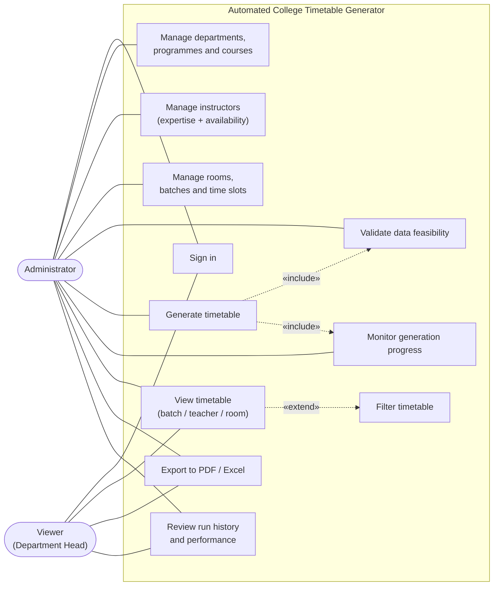
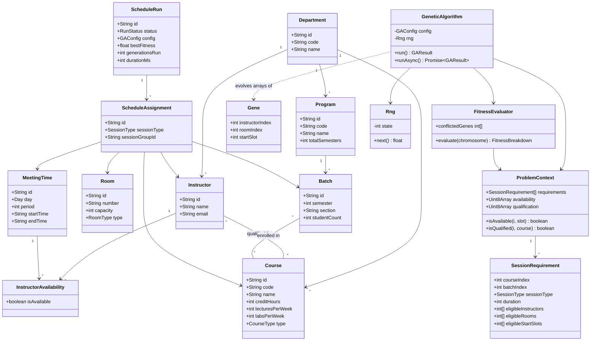
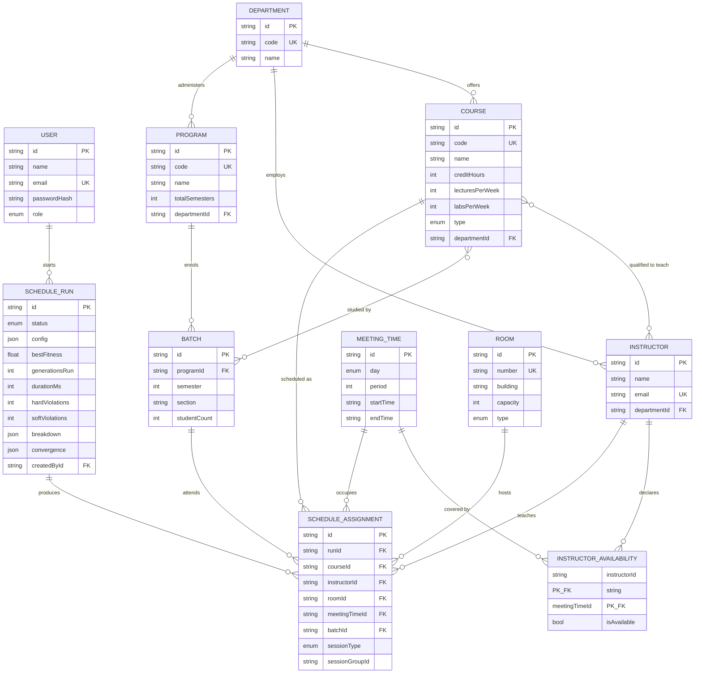
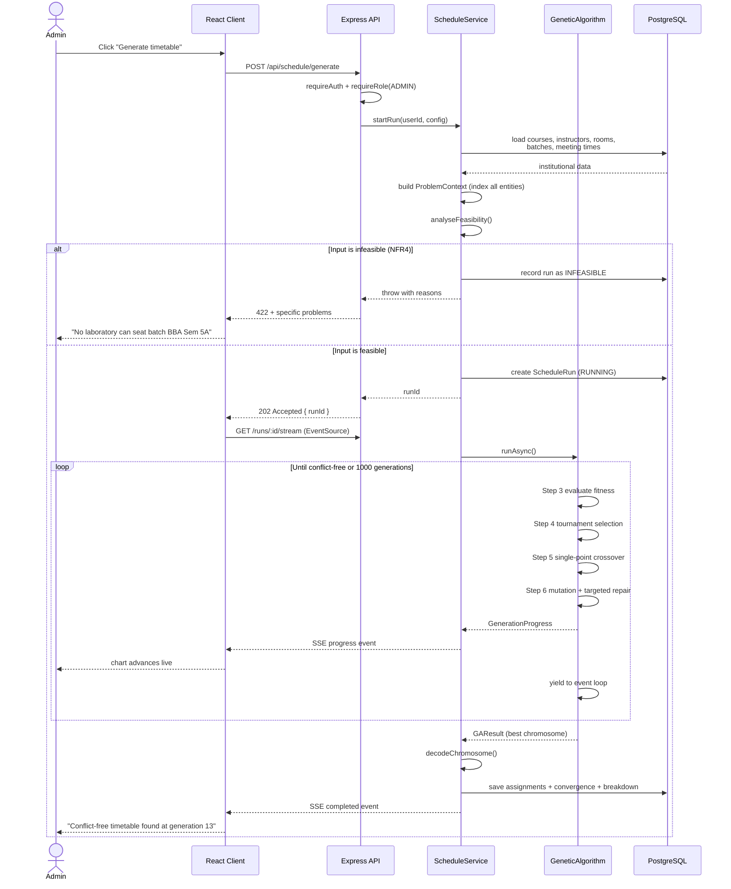
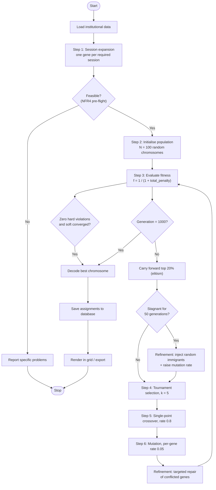
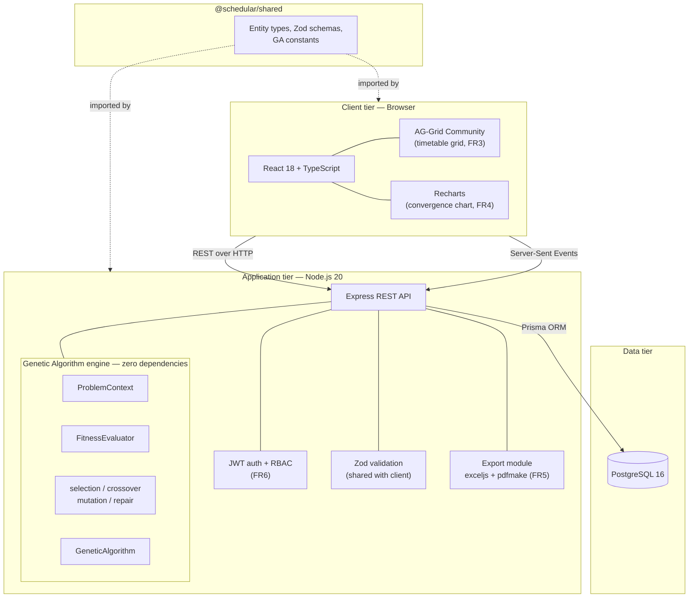
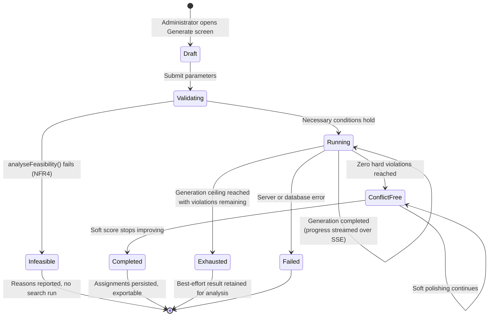
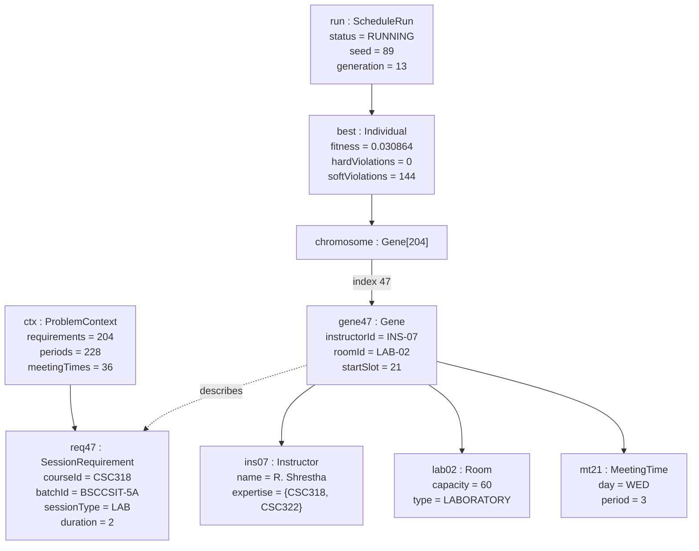

# UML Diagrams

Expected Outcome 6 requires "complete system analysis with UML diagrams". Every diagram
below is written in Mermaid, which renders directly on GitHub and in VS Code, and can be
exported to PNG for the printed report.

---

## 1. Use Case Diagram

Two actors, matching the role split of FR6. The administrator has every viewer capability
plus the ability to modify data and run the algorithm.

---

## 2. Class Diagram

The domain entities of proposal section 4.3.4, together with the algorithm classes. Note
that `FitnessEvaluator`, `GeneticAlgorithm` and the operator modules depend only on
`ProblemContext` -- they never touch Prisma, which is what makes them unit-testable without
a database.

---

## 3. Entity Relationship Diagram

The PostgreSQL schema. Every relationship shown is enforced by a real foreign key, as NFR3
requires.

---

## 4. Sequence Diagram: Timetable Generation

Shows why the generation endpoint returns `202 Accepted` immediately rather than blocking:
the browser must be able to open the progress stream and watch the run it just started.

---

## 5. Activity Diagram: The Genetic Algorithm

The seven steps of proposal section 4.3.2, with the two documented refinements marked.

---

## 6. Component and Deployment Diagram

The three-tier architecture of proposal section 4.3.1.

---

## 7. State Diagram: Lifecycle of a Schedule Run

A `ScheduleRun` row is the system's unit of work. Its states are persisted, so a run's
outcome — including the reason an infeasible dataset was rejected — survives a page reload
or a server restart.

---

## 8. Object Diagram: A Snapshot During Generation

One instant of a benchmark run — generation 13, the moment the first conflict-free
chromosome appears. It shows concrete instances rather than classes, which is what makes
the encoding of §4.3 of the report tangible: gene 47 holds only the three free variables,
while the course, batch and session type are read from requirement 47.

