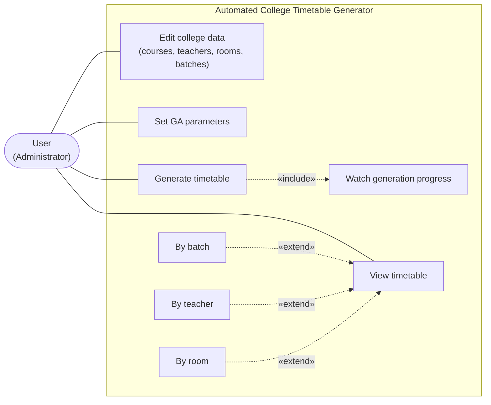
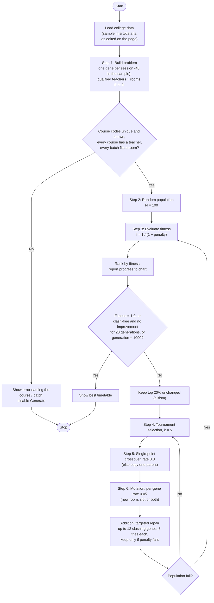
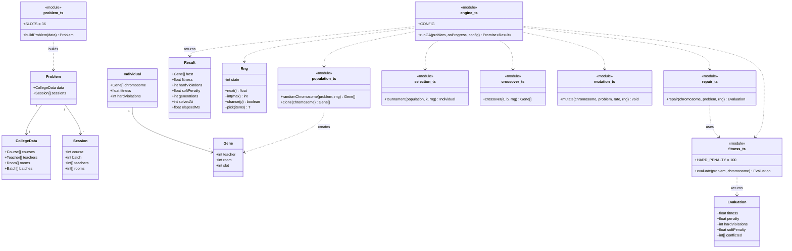
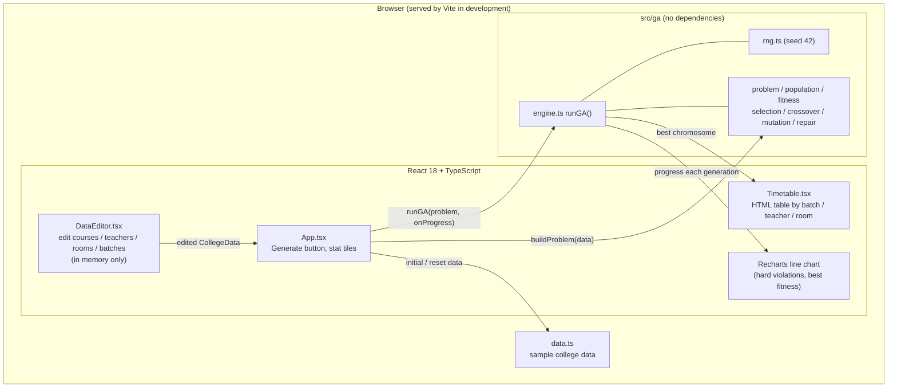

# UML Diagrams

Expected Outcome 6 requires "complete system analysis with UML diagrams". Every diagram
below is written in Mermaid, which renders directly on GitHub and in VS Code, and can be
exported to PNG for the printed report.

---

## 1. Use Case Diagram

One actor. There is no login, so anyone who opens the page can edit the data, generate and view.

---

## 2. Activity Diagram: The Genetic Algorithm

The seven steps of proposal section 4.3.2, with our one addition (targeted repair) marked.

---

## 3. Class / Module Diagram: `src/ga`

Each proposal step is one module. The modules are plain functions over plain data; only
`Rng` is a class. Nothing in `src/ga` depends on React, so the tests run it directly.

---

## 4. Component Diagram

Everything runs in the browser. There is no server and no database.

